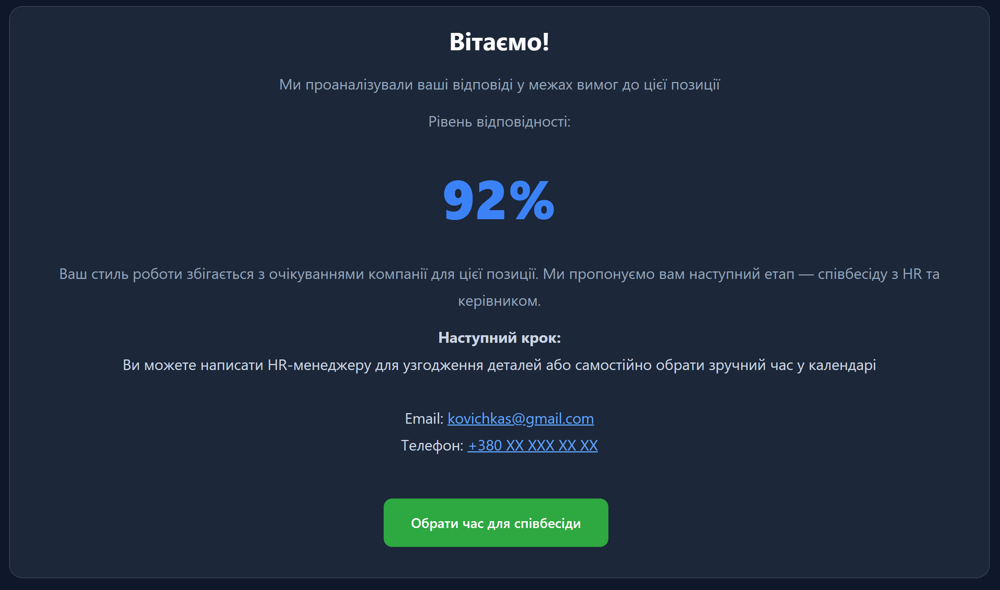

# Candidate Fit Assessment Tool for Sales Role

Інтерактивний веб-прототип для оцінки відповідності кандидата цільовому поведінковому профілю компанії на позиції менеджера з продажу VIP-клієнтам.

## 🔗 Live demo

Інтерактивний HR‑тест для відбору VIP‑менеджерів з продажу:
👉 [Пройти тест](https://kovichka-s.github.io/vip_sales_test_app/test.html)

## Ідея проєкту

Проєкт побудований навколо підходу, що компанія наймає не просто “функцію” і не набір формальних hard skills, а людину, яка має вирішувати конкретні бізнес-проблеми компанії.

Класичний підбір часто спирається на резюме, цифри, попередній досвід і заявлені досягнення. Але такі дані не завжди показують, як людина реально мислить, приймає рішення, працює з конфліктом, клієнтом, командою, відповідальністю та невизначеністю.

Цей прототип пропонує інший підхід: оцінювати не тільки досвід, а стиль мислення, потенціал, поведінкову логіку та здатність кандидата вирішувати саме ті задачі, які важливі для конкретної компанії.

## Основна гіпотеза

Hard skills пришвидшують виконання роботи, але не завжди визначають якість майбутнього результату. Для інтелектуальних ролей важливо оцінювати:

- як людина мислить у складних ситуаціях;
- як вона працює з клієнтом і командою;
- як приймає рішення під тиском;
- як балансує інтереси компанії, клієнта і власну відповідальність;
- наскільки її підхід збігається з поточним бізнес-запитом компанії.

Проєкт виходить з ідеї, що кандидата потрібно оцінювати не лише як носія досвіду, а як потенційного “вирішувача проблем” компанії.

## Що реалізовано

У прототипі реалізовано покрокове проходження 12 ситуаційних запитань. Кандидат бачить одну ситуацію за раз, обирає відповідь і переходить до наступного слайду. Кожна відповідь прив’язана до внутрішнього поведінкового стилю.

Результат рахується не як універсальна “правильність”, а як відсоток збігу з цільовим профілем, який компанія хоче бачити на конкретній позиції.

У поточній версії цільовим профілем є партнерсько-дипломатичний стиль для роботи з VIP-клієнтами.

## Candidate Experience

Кандидат не бачить внутрішні поведінкові мітки. Для нього результат подається у зрозумілій формі:

- відсоток відповідності;
- короткий висновок;
- наступний крок;
- рекомендації або запрошення до співбесіди.

Якщо кандидат набирає 70% або більше, система пропонує перейти до наступного етапу — співбесіди з HR та керівником. Кандидат отримує контакт HR і можливість обрати зручний час у календарі.

## Contact Form та Compliance

Перед стартом тесту кандидат заповнює контактні дані: ім’я та прізвище, email і телефон.

У формі передбачено базову валідацію даних:
- ім’я має містити мінімум два слова;
- телефон вводиться у стандартизованому українському мобільному форматі;
- email має відповідати базовому формату електронної пошти;
- без згоди на обробку персональних даних кандидат не може почати тест.

Окремо враховано compliance-логіку: кандидат має явно погодитися на обробку персональних даних, а текст згоди пояснює мету використання даних — розгляд кандидатури та подальшу комунікацію щодо результатів тесту.

## HR Logic

Для HR передбачена концепція внутрішнього звіту, який дозволяє використовувати тест не лише як фільтр, а як інструмент підготовки до змістовної співбесіди. Окремий блок звіту присвячений аналізу Hard skills це база для майбутнього онбордингу. Це дозволяє заздалегідь підготувати робоче місце та необхідне навчання, розуміючи реальний рівень володіння інструментами (наприклад, CRM чи спеціалізованим софтом).

Деталізація HR-звіту:
*Персональні дані: ПІБ, актуальна пошта та номер телефону для оперативного зв’язку.
*Цільовий профіль: Візуалізація еталонного поведінкового стилю, який компанія шукає на цю роль.
*Результат відповідності: Загальний відсотковий показник збігу відповідей кандидата з цільовим профілем.
*Домінантний стиль: Визначення основного архетипу мислення кандидата на основі його вибору в 12 ситуаціях.
*Аналіз відповідей: Повний розподіл виборів кандидата з виділенням тих моментів, де логіка не збіглася з цільовим профілем (точки для обговорення на співбесіді).
*Аудит Hard Skills: Зріз по 6 ключових технічних інструментах — готовність до роботи з ними або необхідність додаткового навчання для успішного онбордингу.
На самій співбесіді ці дані слугують лише точкою входу, щоб обговорити здатність кандидата до швидкого навчання та його підхід до освоєння нових технологій.

## Приклад результату

[Відкрити приклад HR-звіту](assets/hr-report-example.png)

## Гнучкість профілю

Цільовий профіль може змінюватися залежно від бізнес-запиту компанії.

Наприклад, якщо компанії потрібен не партнерсько-дипломатичний стиль, а більш виконавчий або драйверський підхід, той самий тест може бути переорієнтований на інший профіль. Це дозволяє використовувати результати кандидатів повторно для майбутніх вакансій або змінених потреб бізнесу.

## Мій внесок

Contribution & Project Ownership
У межах цього проєкту я поєднала ролі Business Analyst, Product Thinker та Software Developer, реалізувавши повний цикл створення продукту:

Business Analysis & Product Vision
- Концептуалізація оцінки: Розробила авторську методологію оцінки кандидатів, що базується на аналізі поведінкових реакцій у реальних бізнес-ситуаціях, а не на абстрактних запитаннях.

- Проектування бізнес-логіки: Описала складні алгоритми взаємозв'язків між відповідями користувача та фінальними показниками компетенцій.

- Розробка сценаріїв: Створила розгалужену систему відповідей, адаптовану під різні поведінкові архетипи (4 основні)

- Candidate Journey Design: Спроектувала шлях користувача всередині тесту, щоб забезпечити високий рівень залученості та зрозумілість процесу.

- HR-орієнтованість: Врахувала потреби бізнесу у структуруванні результатів, створивши логіку формування деталізованих звітів для рекрутерів та менеджерів.

Technical Implementation (Development)
- Frontend Development: Самостійно розробила архітектуру фронтенд-частини застосунку, використовуючи HTML5 та CSS3 для створення адаптивного та інтуїтивно зрозумілого інтерфейсу.

- Programming Logic (JavaScript): Написала програмний код на JavaScript, який забезпечує динамічну роботу тесту, обробку вибору користувача та миттєвий розрахунок результатів за заданими правилами.

- Prototyping to MVP: Довела проект від ідеї до технічно функціонуючого прототипу, що готовий до інтеграції та реального використання в робочих процесах.

- Data Integrity & Compliance: Реалізувала базову логіку безпечного збору та обробки персональних даних у межах технічного рішення.

Чому мій підхід відрізняється (Product Philosophy)
На відміну від багатьох стандартних психометричних тестів, мій інструмент:

- Сфокусований на робочому контексті: Питання стосуються конкретних професійних викликів, а не загальних рис характеру.

- Об’єктивність результату: Логіка побудована таким чином, щоб мінімізувати вплив соціальної бажаності відповідей (наприклад, свідоме заниження емпатії чи завищення лідерства), фокусуючись на ефективності для бізнесу.

- Чітка категоризація: Використовує зрозумілі бізнесу архетипи, що дозволяє швидко приймати рішення про відповідність кандидата ролі.

## Статус проєкту

Проєкт перебуває в розвитку. Поточна версія реалізує базове проходження тесту, підрахунок відповідності та результат. Повний HR-звіт прихований.

Наступний етап — збереження результатів кандидата, можливість аналізу відповідей та надсилання звіту на пошту HR (MAKE, AI).
